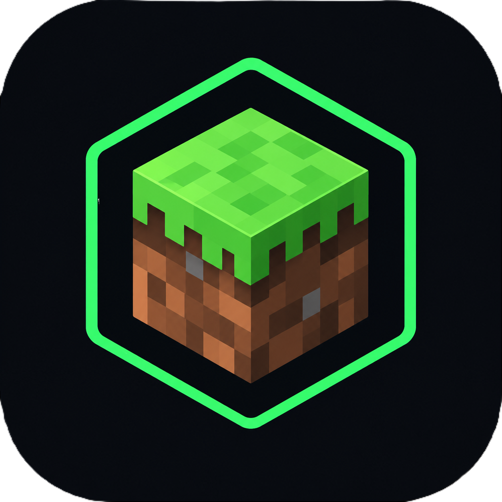

  <!-- Substitua o caminho da imagem 'Assets/logo-software.png' pelo caminho correto no seu repositório -->
  

<h1 align="center">MinecraftTracker</h1>

  <b>Um aplicativo desktop para Windows projetado para monitorar a atividade do jogo e registrar sessões de jogo automaticamente.</b>

---

**MinecraftTracker** é um aplicativo desktop para Windows desenvolvido para monitorar a atividade de jogos e registrar sessões de forma automática. O projeto no momento é focado no Minecraft e foi desenhado como um projeto de portfólio para demonstrar desenvolvimento desktop, monitoramento de processos, design de interface (UI), persistência de dados e organização limpa de código.

## 📌 Visão Geral

O aplicativo detecta se o *Minecraft* está em execução no computador e inicia o cronômetro da sessão automaticamente. Quando o jogo é fechado, a duração da sessão é armazenada no histórico para consulta posterior.

O dashboard apresenta o status atual do jogo, o tempo decorrido da sessão ativa, o tempo total acumulado e as sessões recentes em uma interface visual com design escuro, minimalista e focado no público gamer.

## ✨ Principais Funcionalidades

- **Detecção automática** dos processos do Minecraft.
- **Rastreamento em tempo real** da sessão ativa.
- **Cálculo automático** do tempo total jogado.
- **Indicador de tempo jogado no dia**.
- **Histórico** de sessões recentes.
- **Persistência de dados** utilizando SQLite através do serviço de banco de dados do projeto.
- **Barra de título customizada** do Windows com o ícone do aplicativo.
- **Interface escura e minimalista** voltada para o estilo gamer.
- **Estrutura de navegação** preparada para futuras telas de estatísticas e configurações.

## 🛠️ Tecnologias Utilizadas

- C#
- .NET 8 / WinUI 3
- XAML
- SQLite
- Visual Studio
- Git / GitHub

## 📐 Arquitetura do Projeto

A implementação atual separa a camada visual da lógica de monitoramento:

- `MainWindow.xaml` — Interface gráfica do aplicativo e recursos visuais.
- `MainWindow.xaml.cs` — Configurações da janela, manipuladores de eventos da UI e integração com o ViewModel.
- `MainViewModel` — Monitoramento do jogo, cronômetro de sessão, dados do dashboard e notificações de propriedades (`INotifyPropertyChanged`).
- `DatabaseService` — Persistência e recuperação dos dados das sessões no SQLite.

Esta estrutura foi escolhida para manter as alterações da interface do usuário o mais independentes possível da lógica principal do monitoramento.

## ⚙️ Como Funciona

1. O aplicativo é iniciado e inicializa a janela principal.
2. O dashboard carrega as estatísticas e sessões salvas anteriormente no banco de dados.
3. Um loop em segundo plano verifica periodicamente a execução dos processos associados ao Minecraft.
4. Quando o Minecraft é detectado, o cronômetro da sessão é iniciado.
5. Enquanto o jogo estiver rodando, o tempo decorrido é atualizado continuamente na interface.
6. Quando o Minecraft deixa de ser detectado, a sessão é finalizada.
7. Sessões que cumprem a duração mínima configurada na lógica de rastreamento são salvas no banco de dados.
8. As estatísticas do dashboard e o histórico recente são atualizados.

## 🎯 Escopo Atual

A primeira versão está intencionalmente focada no Minecraft. A estrutura do projeto deixa espaço para futuro suporte a outros jogos, estatísticas mais ricas, opções de configuração, gráficos e páginas adicionais no dashboard.

## 💼 Objetivos de Portfólio

O **MinecraftTracker** foi criado não apenas como uma ferramenta utilitária, mas também como um projeto prático de engenharia de software. Ele demonstra habilidades em:

- Desenvolvimento de aplicações desktop para Windows.
- Criação de interfaces orientadas a eventos (Event-Driven UI).
- Detecção e monitoramento de processos no sistema operacional.
- Programação assíncrona (`async`/`await`).
- *Data binding* e notificação de propriedades na UI.
- Persistência local de dados com bancos relacionais.
- Organização de UI/UX.
- Documentação de código e versionamento com Git/GitHub.

## 🗺️ Roadmap (Planos Futuros)

- [ ] Adicionar estatísticas detalhadas por dia, semana e mês.
- [ ] Adicionar gráficos de evolução do tempo de jogo.
- [ ] Suporte a múltiplos jogos.
- [ ] Gerenciamento de configurações por jogo.
- [ ] Filtros avançados no histórico de sessões.
- [ ] Implementação funcional da página de configurações.
- [ ] Identificação mais robusta de processos para diferentes *launchers* e edições do Minecraft.

## 🚦 Status do Projeto

**Em desenvolvimento (Versão Beta).**

A versão atual estabelece o fluxo principal de monitoramento e a base do dashboard. Novas funcionalidades estão planejadas conforme o projeto evolui.
